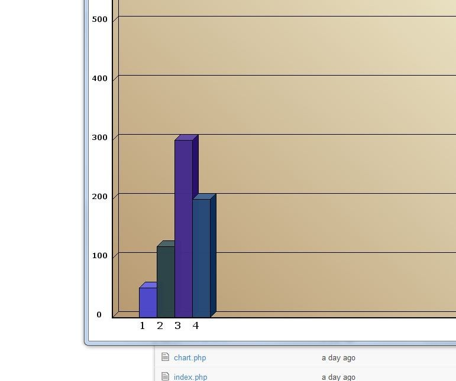
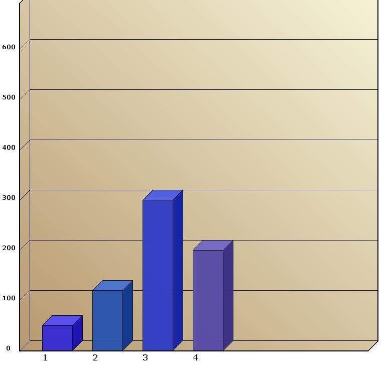

A 3D Barchart written in Java Swing. Displays a 3D barchart and drawn background. 
You can add it as a JComponent to an existing gui in Java or you can 
include it into your website as an Applet. The Bars and the Chart 
itself can be tailored to the specific needs

I have included some sample php code with the required dependencies.
Should work if you copy everything from the project folder to your
server.

